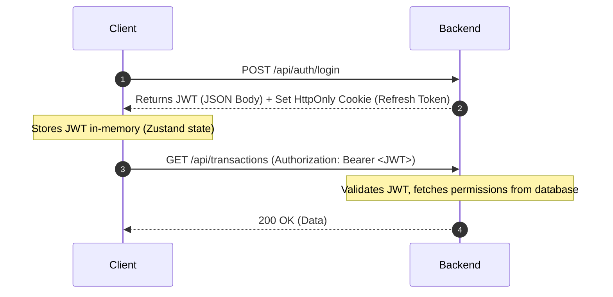
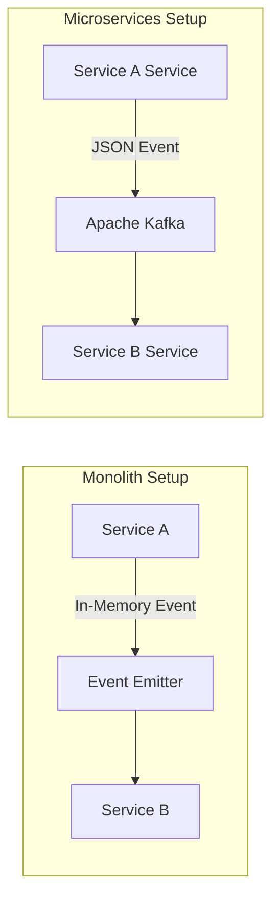

# ExpenseFlow: Production-Grade Project Architecture Design

This document details the architectural blueprint for **ExpenseFlow**, a mobile-only, offline-first Progressive Web App (PWA) expense tracker designed to scale into a multi-tenant financial management SaaS.

---

## 1. Architectural Philosophy

ExpenseFlow uses **Clean Architecture** principles combined with **Feature-Driven Development (FDD)** on the frontend, and a **Modular Monolith** pattern on the backend.

```mermaid
graph TD
    subgraph Client (PWA)
        UI[UI Components / Views] --> Queries[TanStack Query / Zustand]
        Queries --> Sync[Offline Sync Engine]
        Sync --> IDB[(IndexedDB)]
        Sync --> ClientAPI[HTTP Client / Axios]
    end

    subgraph Transport
        ClientAPI -->|HTTPS / JWT| Gateway[Fastify Router]
    end

    subgraph Backend Monolith
        Gateway --> Auth[Auth Module]
        Gateway --> Tx[Transactions Module]
        Gateway --> Budget[Budgets Module]
        
        Auth --> DB[(PostgreSQL)]
        Tx --> DB
        Budget --> DB
        
        Tx -.->|Events| Redis[(Redis Queue)]
        Redis -.-> Worker[Background Workers]
    end
```

### Core Design Pillars
1. **Zero-Trust Security**: Deep checks at every boundary. Identity verification must be resolved on every request (JWT holds no roles, roles are fetched fresh from database or cache).
2. **Offline-First Resilience**: Local database (IndexedDB) acts as the primary source of truth for read/write operations on the client. Changes are queued in an offline Outbox and synced back asynchronously.
3. **Strict Boundaries (Clean Architecture)**: The UI or transport layers are thin adapters. Business logic is isolated from the framework and database drivers.

---

## 2. Frontend Architecture (React + Vite + TS)

### Folder Tree Structure

Below is the production-grade folder structure for the frontend client:

```text
expenseflow-frontend/
├── .env.example
├── .eslintrc.json
├── tsconfig.json
├── vite.config.ts
├── tailwind.config.js
├── index.html
├── src/
│   ├── main.tsx
│   ├── assets/
│   │   ├── branding/
│   │   └── illustrations/
│   ├── config/
│   │   ├── env.ts
│   │   └── constants.ts
│   ├── core/
│   │   ├── api/
│   │   │   ├── client.ts
│   │   │   └── interceptors.ts
│   │   ├── db/
│   │   │   ├── schema.ts
│   │   │   └── database.ts
│   │   ├── sync/
│   │   │   ├── outbox.ts
│   │   │   ├── sync-engine.ts
│   │   │   └── conflict-resolver.ts
│   │   └── theme/
│   │       ├── tokens.ts
│   │       └── variables.css
│   ├── components/
│   │   ├── ui/
│   │   │   ├── button.tsx
│   │   │   ├── drawer.tsx
│   │   │   ├── input.tsx
│   │   │   ├── modal.tsx
│   │   │   └── toast.tsx
│   │   └── feedback/
│   │       └── skeleton-loader.tsx
│   ├── layouts/
│   │   ├── auth-layout.tsx
│   │   ├── app-layout.tsx
│   │   └── dashboard-layout.tsx
│   ├── hooks/
│   │   ├── use-online-status.ts
│   │   └── use-keyboard-shortcut.ts
│   ├── providers/
│   │   ├── query-provider.tsx
│   │   ├── theme-provider.tsx
│   │   └── router-provider.tsx
│   ├── routes/
│   │   ├── index.tsx
│   │   ├── guards.tsx
│   │   └── paths.ts
│   ├── services/
│   │   ├── logger-service.ts
│   │   └── analytics-service.ts
│   ├── utils/
│   │   ├── currency.ts
│   │   ├── date.ts
│   │   └── encryption.ts
│   ├── types/
│   │   └── index.ts
│   ├── service-worker/
│   │   ├── sw.ts
│   │   ├── cache-strategies.ts
│   │   └── register-sw.ts
│   └── features/
│       ├── auth/
│       │   ├── components/
│       │   │   ├── login-form.tsx
│       │   │   └── register-form.tsx
│       │   ├── hooks/
│       │   │   └── use-auth-session.ts
│       │   ├── queries/
│       │   │   └── use-current-user.ts
│       │   ├── mutations/
│       │   │   ├── use-login-mutation.ts
│       │   │   └── use-logout-mutation.ts
│       │   ├── state/
│       │   │   └── session-store.ts
│       │   ├── schemas/
│       │   │   └── auth-schemas.ts
│       │   ├── types/
│       │   │   └── auth-types.ts
│       │   └── index.ts
│       ├── transactions/
│       │   ├── components/
│       │   │   ├── transaction-list.tsx
│       │   │   ├── transaction-card.tsx
│       │   │   └── transaction-form.tsx
│       │   ├── hooks/
│       │   │   └── use-transaction-filter.ts
│       │   ├── queries/
│       │   │   └── use-get-transactions.ts
│       │   ├── mutations/
│       │   │   ├── use-create-transaction.ts
│       │   │   └── use-delete-transaction.ts
│       │   ├── state/
│       │   │   └── filter-store.ts
│       │   ├── schemas/
│       │   │   └── transaction-schemas.ts
│       │   ├── types/
│       │   │   └── transaction-types.ts
│       │   └── index.ts
│       └── budgets/
│           ├── components/
│           ├── hooks/
│           ├── queries/
│           ├── mutations/
│           └── index.ts
```

### Folder Explanations (Frontend)

*   **`src/core/`**: Crucial system infrastructure that provides baseline capability (database setup, API instance, offline-sync protocols, style tokens).
*   **`src/components/ui/`**: Base UI elements. These are purely visual, presentation-only components (e.g. customized elements built on top of Radix primitives and Tailwind CSS). They do not contain any business domain logic.
*   **`src/layouts/`**: Reusable page wrapper layouts containing standard chrome elements (e.g., bottom navigation bar, header bars).
*   **`src/features/`**: Code organized around functional business concepts. Rather than grouping all code by mechanical types (`components`, `stores`, etc.), FDD consolidates relevant code within feature domains to minimize cognitive load and allow independent iteration.
*   **`src/providers/`**: Custom React context providers that bootstrap libraries like TanStack Query, React Router, or theme parameters.
*   **`src/service-worker/`**: Registration and custom script bundles executing inside the Service Worker thread to control offline assets and intercept network requests.

### Import Dependency Rules (Frontend)

```text
[ Feature A ] <========== X (Strictly Prohibited) ===========> [ Feature B ]
     ||                                                             ||
     || (Must only import via public API interface)                 ||
     \/                                                             \/
[ Feature A/index.ts ]                                     [ Feature B/index.ts ]
```

1.  **Feature Isolation**: Features cannot deep-import from other features. For example, `features/transactions` cannot import `features/auth/components/login-form.tsx`.
2.  **Public API Interface (Barrel Exports)**: If a feature must communicate with another, it must only reference items exported explicitly by the target feature's `index.ts` (barrel file).
3.  **Strict Layering**:
    *   `core/` and `components/ui/` cannot import from `features/`.
    *   `features/` can import from `core/`, `components/ui/`, `layouts/`, `hooks/`, `utils/`, and `providers/`.
    *   `utils/` must be composed of stateless, side-effect-free pure functions. They cannot import from anywhere else except configuration parameters or static types.

#### Enforcement Configuration (`.eslintrc.json`)
```json
{
  "plugins": ["import"],
  "rules": {
    "no-restricted-imports": [
      "error",
      {
        "patterns": [
          {
            "group": ["@/features/*/*"],
            "message": "Do not deep import from feature modules. Import from '@/features/[feature-name]' (index.ts) instead."
          }
        ]
      }
    ]
  }
}
```

---

## 3. Backend Architecture (Fastify + TypeScript)

### Folder Tree Structure

```text
expenseflow-backend/
├── docker-compose.yml
├── Dockerfile
├── package.json
├── tsconfig.json
├── drizzle.config.ts
├── src/
│   ├── server.ts
│   ├── app.ts
│   ├── config/
│   │   ├── environment.ts
│   │   └── security.ts
│   ├── common/
│   │   ├── errors/
│   │   │   ├── custom-errors.ts
│   │   │   └── error-handler.ts
│   │   ├── middleware/
│   │   │   ├── request-validator.ts
│   │   │   └── rate-limiter.ts
│   │   ├── plugins/
│   │   │   ├── db-plugin.ts
│   │   │   ├── redis-plugin.ts
│   │   │   └── auth-plugin.ts
│   │   ├── types/
│   │   │   └── index.ts
│   │   └── utils/
│   │       └── password.ts
│   ├── database/
│   │   ├── client.ts
│   │   ├── schema/
│   │   │   ├── index.ts
│   │   │   ├── users.ts
│   │   │   ├── transactions.ts
│   │   │   └── budgets.ts
│   │   ├── migrations/
│   │   └── seeds/
│   │       └── index.ts
│   ├── services/
│   │   ├── email-service.ts
│   │   ├── storage-service.ts
│   │   └── metrics-service.ts
│   ├── queues/
│   │   ├── email-queue.ts
│   │   └── sync-queue.ts
│   ├── workers/
│   │   ├── email-worker.ts
│   │   └── sync-worker.ts
│   └── modules/
│       ├── auth/
│       │   ├── routes.ts
│       │   ├── controller.ts
│       │   ├── service.ts
│       │   ├── repository.ts
│       │   ├── schemas.ts
│       │   └── index.ts
│       ├── transactions/
│       │   ├── routes.ts
│       │   ├── controller.ts
│       │   ├── service.ts
│       │   ├── repository.ts
│       │   ├── schemas.ts
│       │   └── index.ts
│       └── budgets/
│           ├── routes.ts
│           ├── controller.ts
│           ├── service.ts
│           ├── repository.ts
│           ├── schemas.ts
│           └── index.ts
```

### Folder Explanations (Backend)

*   **`src/common/plugins/`**: Custom Fastify plugin integrations. It bootstraps clients for databases (Drizzle), key-value stores (Redis), and JWT authentication, making them accessible via `fastify.db`, `fastify.redis`, etc.
*   **`src/database/schema/`**: Contains the Drizzle schema files defining database structures, relationships, and metadata.
*   **`src/modules/`**: Contains functional modules. Each module bundles its own HTTP routing layer, controller handlers, transactional services, database repository operations, and payload validation structures.
*   **`src/queues/` & `src/workers/`**: Set up background work processing pipelines (e.g. BullMQ backed by Redis) for async work like sending verify emails, running batch operations, or handling sync actions.

### Dependency Flow and Code Responsibilities

```text
[ HTTP Request ] 
      ||
      \/
[ Routes ]          --> Payload validation (Fastify schemas / Zod validation)
      ||
      \/
[ Controller ]      --> Maps transport objects, handles HTTP codes
      ||
      \/
[ Service ]         --> Implements business logic and orchestrates database transactions
      ||
      \/
[ Repository ]      --> Executes raw/ORM queries, isolates SQL away from services
      ||
      \/
[ Database (PG) ]
```

#### Layer Responsibilities
*   **Validation**: Validation should occur at the **Route Entrypoint** using Fastify's schema validators (or Zod) to catch invalid input before execution. Domain invariant checks (e.g., checking if user has enough balance) should reside in the **Service Layer**.
*   **Business Logic**: Should reside entirely within the **Service Layer**. Routes and controllers should remain thin adapters that route data and handle status codes.
*   **SQL Isolation**: Database access logic belongs inside the **Repository Layer**. This allows database structure changes without impacting business domain services.
*   **Database Transactions**: Transaction orchestration must live inside the **Service Layer**. Because business actions often involve multiple database changes, services need to run queries within an atomic transaction.

##### Example Service Orchestrating Transaction (TypeScript)
```typescript
// src/modules/transactions/service.ts
import { db } from "@/database/client";
import { TransactionRepository } from "./repository";
import { BudgetRepository } from "../budgets/repository";

export class TransactionService {
  constructor(
    private txRepo: TransactionRepository,
    private budgetRepo: BudgetRepository
  ) {}

  public async recordExpense(userId: string, data: CreateTransactionDTO) {
    // Run multiple actions inside a transaction
    return await db.transaction(async (trx) => {
      // 1. Write the transaction
      const transaction = await this.txRepo.create(trx, userId, data);

      // 2. Adjust budget
      await this.budgetRepo.deductBudget(trx, data.categoryId, data.amount);

      return transaction;
    });
  }
}
```

---

## 4. Performance & Offline-First Engineering

### Client Offline Architecture (IndexedDB + Outbox Pattern)

```text
[ User Action ] 
      ||
      \/
[ UI Components ]
      ||
      \/
[ TanStack Query / Zustand Store ] (Instant UI updates)
      ||
      \/
[ IndexedDB Local DB ] (Persisted immediately)
      ||
      \/
[ Queue Sync Engine ] 
      ||---> Network Online? ---> [ API Client ] --> [ Backend ]
      ||
      +----> Network Offline? ---> Wait for 'online' event / Service Worker Background Sync
```

1.  **Local Source of Truth**: All data reads are powered by IndexedDB. The app query states are cached locally inside IndexedDB using a wrapper like `Dexie.js`.
2.  **The Outbox Pattern**: When offline write actions happen, they are written to a local `outbox` table in IndexedDB.
    ```typescript
    interface OutboxItem {
      id: string; // ULID
      action: 'CREATE' | 'UPDATE' | 'DELETE';
      payload: any;
      timestamp: number;
      retryCount: number;
    }
    ```
3.  **Sync Engine**: The Sync Engine monitors the user's connection status.
    *   When the browser goes online, the Outbox queue runs sequentially (FIFO).
    *   Conflicts are managed using a Last-Write-Wins (LWW) mechanism backed by client-side timestamps, or manual resolution prompts for complex resource updates.

### Virtual Scrolling & Keyset Pagination

*   **Keyset (Cursor-Based) Pagination**: Offsets degrade database read performance at scale. ExpenseFlow uses cursor-based pagination for transaction historical queries:
    ```sql
    SELECT * FROM transactions 
    WHERE user_id = $1 AND created_at < $2 
    ORDER BY created_at DESC 
    LIMIT 20;
    ```
*   **Virtual Lists**: Render only visible items in the viewport using `@tanstack/react-virtual` to keep memory consumption low when browsing lists with thousands of items.

---

## 5. Zero-Trust Security Design

### JWT Authentication Flow
*   **Access Token**: Emitted in the HTTP response body as a JSON payload, stored only in client memory. Never persisted inside localStorage to mitigate cross-site scripting (XSS) risks.
*   **Refresh Token**: Set as an `HttpOnly`, `Secure`, `SameSite=Strict` cookie path-restricted to `/api/auth/refresh`.



### PostgreSQL Row-Level Security (RLS) & Multi-Tenancy

Every tenant table contains an `organization_id` or `user_id` identifier.
```sql
-- Enable RLS
ALTER TABLE transactions ENABLE ROW LEVEL SECURITY;

-- Apply Tenant Isolation Policy
CREATE POLICY transaction_tenant_isolation ON transactions
  USING (user_id = current_setting('app.current_user_id'));
```

Using Drizzle ORM, a standard middleware session wrapper sets this variable at transaction start:
```typescript
await db.execute(sql`SET LOCAL app.current_user_id = ${currentUserId}`);
```

---

## 6. Testing Strategy

### Test Layout Blueprint

```text
tests/
├── unit/
│   ├── frontend/
│   │   └── use-transaction-filter.test.ts
│   └── backend/
│       └── password-utils.test.ts
├── integration/
│   ├── database/
│   │   └── transaction-repository.test.ts
│   └── api/
│       └── auth-routes.test.ts
└── e2e/
    ├── offline-sync.spec.ts
    └── auth-flow.spec.ts
```

*   **Unit Tests**: Run in Vitest. Used to test logical services, domain functions, and client state machines.
*   **Integration Tests**: Run in Vitest/Jest. Database operations run against Docker test containers to verify actual query behavior.
*   **End-to-End Tests**: Run in Playwright. Focuses on key user journeys, simulation of offline behavior, storage verification, and service worker caching strategies.

---

## 7. Common Mistakes to Avoid

1.  **Direct Database Inter-Module Querying**: Allowing the `budgets` module services to direct-query the `transactions` table. This ties schemas together tightly and blocks attempts to isolate into microservices. Instead, access data via exported interfaces, public service wrappers, or a message publisher.
2.  **Accessing JWT Roles directly on Frontend**: Relying on decoded JWT roles for strict client operations. A local token could be manipulated; all actions must be checked on the backend during service execution.
3.  **Local Storage as Database Cache**: Using `localStorage` for holding transaction tables. LocalStorage has a blocking API, is limited to ~5MB, and can cause frame drops. Always use IndexedDB for business domain storage.
4.  **No Limits on Sync Outbox Replay**: Letting an infinite sync fail loop block client queues. Always implement exponential backoff limits and retry bounds (e.g., maximum 5 retries before pushing to a DLQ/manual review status).

---

## 8. Recommended Libraries

| Functionality | Frontend Library | Backend Library |
| :--- | :--- | :--- |
| **Framework** | React 19 + Vite | Fastify |
| **Styling** | Tailwind CSS | N/A |
| **State Manager** | Zustand | Redis |
| **API Client & Sync** | TanStack Query v5 | Axios / Native Fetch |
| **Validation** | Zod | Zod / Typebox |
| **Database** | Dexie.js (IndexedDB) | Drizzle ORM + PG |
| **Job Queue** | N/A | BullMQ |

---

## 9. Development Standards & Conventions

### Coding Style Guide
*   **File Naming**: Use kebab-case for all files to maintain consistency across OS build agents: `transaction-card.tsx`, `auth-service.ts`.
*   **Conventional Commit Specifications**:
    *   `feat: add offline search caching`
    *   `fix: resolve balance sync calculation drift`
    *   `refactor: isolate db schemas`

---

## 10. Future Microservices Migration Plan

To prepare the Modular Monolith for a future microservices migration:
1.  **Separate Databases at Schema Level**: Ensure modules do not query across database boundaries. If `transactions` needs a user's name, it must call `auth-service` or rely on a shared event database projection, rather than performing SQL joins on the `users` table.
2.  **Decouple Services via Events**: Avoid direct component class instantiation. Instead, rely on an internal message bus (like an event emitter) to emit events (e.g. `TransactionCreated`). This allows replacing the memory bus with Kafka or RabbitMQ without rewriting the core business logic.



---

## 11. Documentation Standards (`docs/`)

Keep project documentation in the repository root:
```text
docs/
├── architecture/
│   └── index.md             # Overview of structural layers
├── adr/
│   └── 0001-offline-db.md   # Architectural Decision Records
├── api/
│   └── openapi.yaml         # OpenAPI 3.0 specification
├── database/
│   └── schema.dbml          # Database structure files
└── onboarding/
    └── setup.md             # Setup guide for new developers
```
