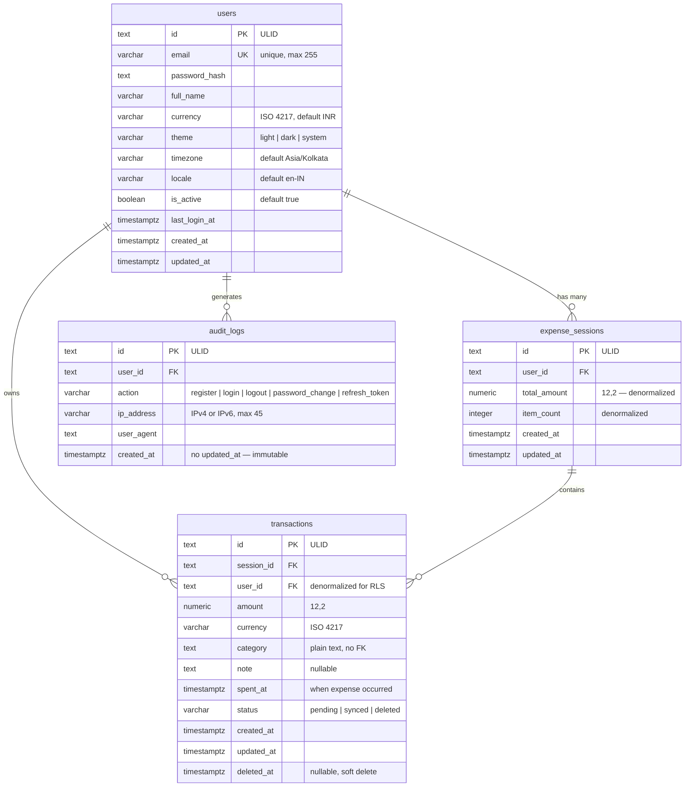

# ExpenceFlow — Database Architecture

## Schema Diagram



---

## Tables

### `users`
Stores only what's needed for auth and personalization.

| Column | Type | Notes |
|---|---|---|
| `id` | `TEXT` | ULID primary key |
| `email` | `VARCHAR(255)` | Unique, indexed |
| `password_hash` | `TEXT` | bcrypt hash |
| `full_name` | `VARCHAR(255)` | Nullable — not split into first/last |
| `currency` | `VARCHAR(3)` | ISO 4217, default `INR` |
| `theme` | `VARCHAR(10)` | `light` \| `dark` \| `system` |
| `timezone` | `VARCHAR(100)` | Default `Asia/Kolkata` |
| `locale` | `VARCHAR(10)` | Default `en-IN` |
| `is_active` | `BOOLEAN` | Soft-disable without deletion |
| `last_login_at` | `TIMESTAMPTZ` | Nullable |

> **Why `full_name` not `first_name + last_name`?** Avoids cultural assumptions and is simpler for a personal expense app. Can be split later if needed.

---

### `expense_sessions`
Represents one "capture workflow" — the user opens the app, adds N expenses, taps Done.

| Column | Type | Notes |
|---|---|---|
| `id` | `TEXT` | ULID primary key |
| `user_id` | `TEXT` | FK → `users.id` |
| `total_amount` | `NUMERIC(12,2)` | Denormalized — updated on each transaction insert/delete |
| `item_count` | `INTEGER` | Denormalized — count of transactions in session |

> **Why denormalize `total_amount` and `item_count`?** Avoids a `SUM` query on every session load. Recalculated atomically when transactions are inserted or deleted.

---

### `transactions`
The core business table. One row = one expense item.

| Column | Type | Notes |
|---|---|---|
| `id` | `TEXT` | ULID primary key |
| `session_id` | `TEXT` | FK → `expense_sessions.id` |
| `user_id` | `TEXT` | FK → `users.id` — **denormalized** |
| `amount` | `NUMERIC(12,2)` | Up to 9,999,999,999.99 |
| `currency` | `VARCHAR(3)` | Per-transaction ISO 4217 |
| `category` | `TEXT` | Plain text, no FK |
| `note` | `TEXT` | Nullable free-text memo |
| `spent_at` | `TIMESTAMPTZ` | When the expense occurred, not `created_at` |
| `status` | `VARCHAR(20)` | `pending` → `synced` → `deleted` |
| `deleted_at` | `TIMESTAMPTZ` | Nullable — soft delete |

> **Why `user_id` on `transactions` if it's already on `expense_sessions`?**  
> Denormalized for two reasons:
> 1. **RLS (Row Level Security)**: PostgreSQL RLS policies need `user_id` on the table directly to filter without a join
> 2. **Performance**: Avoids a join on every `WHERE user_id = ?` query

> **Why `category` as TEXT not a FK to a categories table?**  
> ExpenceFlow uses a fixed small set of categories defined in the UI. No join needed. A `categories` table can be added later if users need custom colors, ordering, or metadata.

> **Why `NUMERIC(12,2)` not `FLOAT`?**  
> Floats have rounding errors. Financial data must use fixed-point decimal. `NUMERIC(12,2)` stores up to ₹9,999,999,999.99 exactly.

---

### `audit_logs`
Append-only auth event log.

| Column | Type | Notes |
|---|---|---|
| `id` | `TEXT` | ULID primary key |
| `user_id` | `TEXT` | FK → `users.id` |
| `action` | `VARCHAR(50)` | `register` \| `login` \| `logout` \| `password_change` \| `refresh_token` |
| `ip_address` | `VARCHAR(45)` | Supports IPv4 (15) and IPv6 (39) |
| `user_agent` | `TEXT` | Browser/app string |
| `created_at` | `TIMESTAMPTZ` | No `updated_at` — rows are immutable |

> **Why no `updated_at`?** Audit log rows must never be modified. The absence of `updated_at` makes this constraint self-documenting.

---

## Indexes

| Index | Table | Columns | Reason |
|---|---|---|---|
| `users_email_idx` | `users` | `email` | Login lookup |
| `expense_sessions_user_id_idx` | `expense_sessions` | `user_id` | All sessions by user |
| `transactions_user_id_idx` | `transactions` | `user_id` | All expenses by user |
| `transactions_spent_at_idx` | `transactions` | `spent_at DESC` | Chronological history |
| `transactions_user_spent_at_idx` | `transactions` | `(user_id, spent_at)` | User-scoped timeline — most common query |
| `audit_logs_user_id_idx` | `audit_logs` | `user_id` | Auth history by user |

---

## Foreign Key Relationships

```
users
  └── expense_sessions.user_id → users.id
  └── transactions.user_id     → users.id
  └── audit_logs.user_id       → users.id

expense_sessions
  └── transactions.session_id  → expense_sessions.id
```

---

## RLS-Ready Structure

Every child table has `user_id` as a direct column. This means PostgreSQL Row Level Security policies can be applied without joins:

```sql
-- Example RLS policy (future implementation)
ALTER TABLE transactions ENABLE ROW LEVEL SECURITY;

CREATE POLICY user_isolation ON transactions
  USING (user_id = current_setting('app.current_user_id'));
```

---

## File Locations

| File | Path |
|---|---|
| `users.ts` | [schema/users.ts](file:///c:/Users/minha/expencio/apps/backend/src/database/schema/users.ts) |
| `expense_sessions.ts` | [schema/expense_sessions.ts](file:///c:/Users/minha/expencio/apps/backend/src/database/schema/expense_sessions.ts) |
| `transactions.ts` | [schema/transactions.ts](file:///c:/Users/minha/expencio/apps/backend/src/database/schema/transactions.ts) |
| `audit_logs.ts` | [schema/audit_logs.ts](file:///c:/Users/minha/expencio/apps/backend/src/database/schema/audit_logs.ts) |
| `index.ts` | [schema/index.ts](file:///c:/Users/minha/expencio/apps/backend/src/database/schema/index.ts) |
| Migration SQL | [0000_yummy_silver_samurai.sql](file:///c:/Users/minha/expencio/apps/backend/src/database/migrations/0000_yummy_silver_samurai.sql) |

---

## Future Tables (Not Yet Implemented)

| Table | Purpose | Trigger |
|---|---|---|
| `categories` | Custom user categories with colors/icons | When users need personalization |
| `budgets` | Monthly or category spending limits | Budget feature |
| `attachments` | Receipt photos, documents | Receipt capture feature |
| `recurring_transactions` | Subscriptions, EMIs | Recurring expense feature |
| `refresh_tokens` | JWT refresh token store | If switching to DB-backed tokens |
| `sync_metadata` | Offline sync conflict resolution | Multi-device sync |
| `notifications` | Push notification log | Notification feature |
